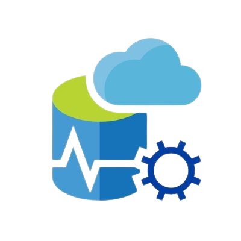

<h1 style="text-align: center;">CargoSync - Solution for the Transport assignment</h1>


## Table of Contents
- ### Project Information
- ###  Features
  - #### Delivery Management
  - #### Cargo Information Tracking
  - #### User Management
  - #### Revenue Tracking
- ### Languages
  - #### Backend
  - #### Frontend
  - #### Database
- ### Tools
- ### Installation
- ### Build from Source
- ### Access Online

## 🚀 Project Information

CargoSync is a comprehensive web application designed to streamline and enhance the management of cargo deliveries. It provides a robust set of features to optimize logistics and improve overall efficiency in cargo transportation.

## 🌟 Features

### 📦 Delivery Management

  - Track and manage the details of deliveries, including destination, estimated time of arrival (ETA), and status.
  - User-friendly interface for easy navigation and monitoring of delivery-related information.

### 📊 Cargo Information Tracking

  - Efficiently manage cargo information, including descriptions and quantities, to ensure accurate and organized cargo handling.
  - Real-time updates on cargo status and location within the delivery process.

### 👤 User Management

  - User authentication and authorization to control access and ensure data security.
  - Differentiate user roles, such as administrators and standard users, for tailored access to features.

### 💰 Revenue Tracking

  - Keep track of revenue generated from cargo deliveries.
  - Detailed reports and analytics to analyze revenue trends over time.

## 💻 Languages

- ### 🔙 Backend
  <p align="left"> 
      <a></a>
      <a> </a>
      <a> </a>
      <a> </a>
  </p>
- ### 🌐 Frontend
  <p align="left"> 
      <a></a>
      <a> </a>
       <a> </a>
  </p>
- ### 🛢️ Database
  <p align="left"> 
      <a></a>
  </p>

## 🛠️ Tools
  <p align="left"> 
    <a></a>
    <a></a>
    </a>
    <a></a>
    </a>
    <a></a>
    <a></a>
    <a>
    <a></a>
    <a></a>
  </p>

## ⚙️ Installation

You can download the project by using the green "Code" button.

Or by pasting the following code in your CMD:
```bash
git clone https://github.com/codingburgas/2324-technologies-11-transport-assignment-KKDinev20
```

## 🔨 Build from Source

To run the app locally, debug the project by pressing F5 or choose to run the CargoSync.Presentation.

## 🌐 Access Online

Open your web browser and navigate to https://cargosync.azurewebsites.net to access CargoSync.